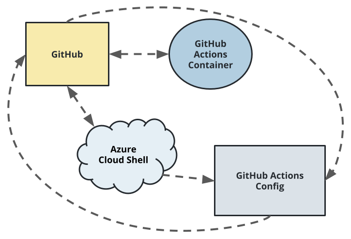

# Overview

<TODO: complete this with an overview of your project>
This is a Flask python application that will be used to create a simple CICD pipeline.

## Project Plan
-  [Trello board for the project](https://trello.com/invite/b/8igBItiz/494161f2be1dc82f50f17ecc700a74bb/udacity-devops-building-cicd-pipeline).
- [Spreadsheet for the project](./assets/project-management.xlsx)
## Instructions



1. Go to Azure portal and open bash shell.
```bash
https://portal.azure.com/
```

2. Clone the project from the repository.
```bash
git clone git@github.com:MaiQD/udacity-devops-building-cicd-pipeline.git
```

3. Go to the project folder and create a virtual environment (venv) using the command:
```bash
	make setup
```
And then activate the virtual environment:
```bash
	source ~/.udacity-devops/bin/activate
```

4. Run the following command to install all the dependencies and test the project:
```bash
	make all
```


5. Set up the CI pipeline with GitHub Actions and result when push to the repository:


6. Set up the CD pipeline with Azure Pipelines by following [instruction](https://docs.microsoft.com/en-us/azure/devops/pipelines/ecosystems/python-webapp?view=azure-devops) and result when push to the repository:


7. The app service will automatically deploy the project to Azure. You can see the project running when you visit the URL: [datmq-udacity-project.azurewebsites.net/](https://datmq-udacity-project.azurewebsites.net/)


8. You can start predicting by running the following command:
```bash
./make_predict_azure_app.sh
```
The results will be displayed in the console.

9. You can use this command to see the logs of the app service:
```
az webapp log tail
```

10. Load test with Locust
- intall Locust:
```
pip install locust
```
- Run Locust:
```
locust
```
- Go to localhost:8089 to go to the Locust dashboard. Input Host: https://datmq-udacity-project.azurewebsites.net/


- Select start swarming


## Enhancements
Make a new pipeline using AspNetCore to be the main framework for the project.
## Demo 
[Youtube demo video](https://youtu.be/Ot0zfkMWyXM)


